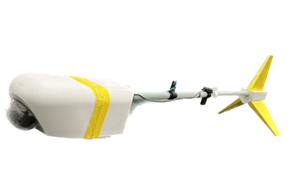
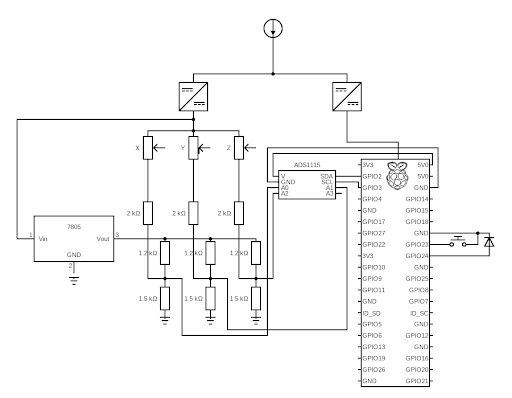

# Misvisning på landingsbane
<p align="center">
  
</p>


### Scripts
**main.py** kører on boot og styrer følgende scripts:
- **magnetometer** logger flux-gate dataen som .csv
- **tagbillede** tager billeder med pycamera
- **gps** logger IMU data og gemmer det som .anpp samt tid i .txt

### Installation
#### pip install
Alle dependencies er installeret med **pip install** fra rasp-pi. (Husk at rasp-pi skal have internetforbindelse!)
#### Autoboot
Følg <a href="https://www.makeuseof.com/how-to-run-a-raspberry-pi-program-script-at-startup/">denne vejledning</a> (3. metode) til at køre et program, når rasp-pi booter:

1. Lav en fil i mappen /home/magneten/.config/autostart og kald den filnavn.desktop
2. Tilgå filen ved at skrive **sudo nano /home/magneten/.config/autostart/filnavn.desktop** i terminalen
3. Tilføj følgende til filnavn.desktop: 
  ```sh
[Desktop Entry]
Type=Application
Name=Bird
Exec=/usr/bin/python3 /home/pi/magneten/main.py
  ```
I dette tilfælde hedder brugeren "magneten" og filen hedder "main.py"

4. Tryk **CTR + S** for at gemme filen og tryk **CTR + X** for at lukke filen, skriv dernæst **sudo reboot** i terminalen for at genstarte Raspberry Pi

####

### Kamera
For at kameraet virker skal raspberry konfigureres:
1. Skriv følgende i terminal
  ```sh
sudo raspi-config
  ```
2. Tryk på interface og slå "legacy camera mode" fra
3.  ```sudo reboot ```
### Elektrisk kredsløb
<p align="center">
  
</p>
